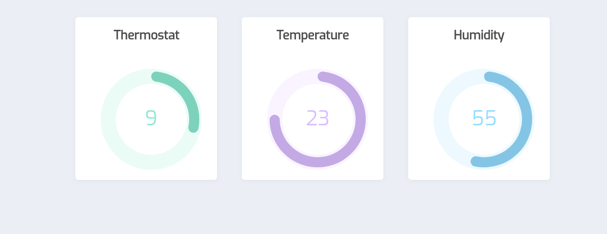

# kubernetes-code-garden
Kubernetes Talk @ Code Garden Roma

## instructions

```
docker build -t francescou/dashboard:1.7 containers/dashboard/
docker build -t francescou/humidity:1.0 containers/humidity/
docker build -t francescou/temperature:1.1 containers/temperature/
docker build -t francescou/thermostat:1.3 containers/thermostat/
```

`kubectl apply -f .`

`$(minikube ip) myminikube.info >> /etc/hosts`

open <http://myminikube.info/>

